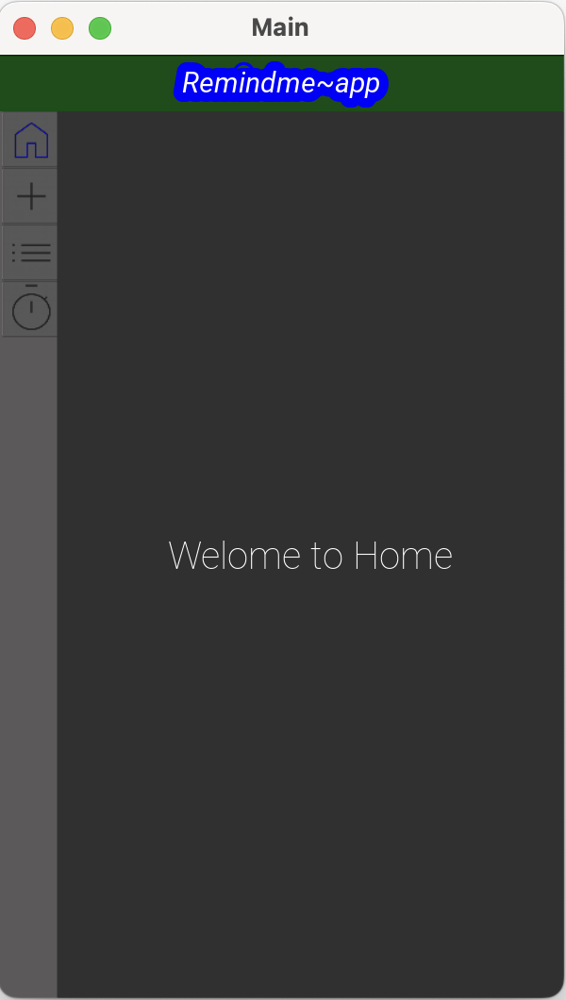
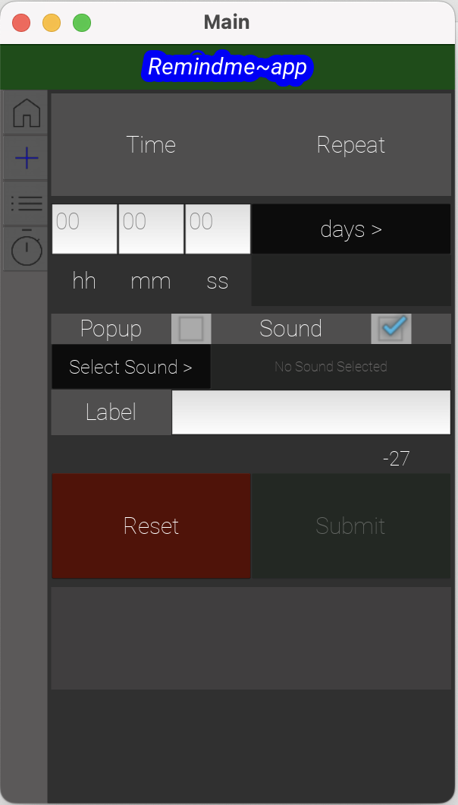
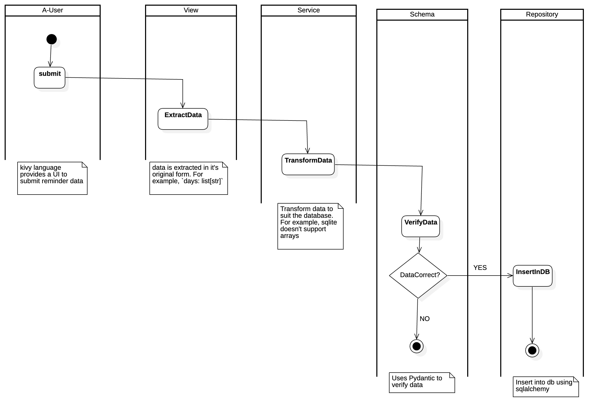

# Remind Me App

This is a refined version of the [remindme-app](https://github.com/Eyongkevin/remindme-app).

## About 
This is a reminder app developed using the [Kivy framework](https://kivy.org/). It lets you schedule events that alerts you when it's time. Additionally, it features a stopwatch, ideal for timing tasks such as student exercises.

Every part of this app is implemented in series and posted on my [YouTube channel](https://www.youtube.com/@codewithenow4045)

## Part 1: Planning & Setup
The aim of this part is to restructure or re-plan the RemindMeApp from the old version. 

Here are a few things that was done
- 👉🏼 Non-function requirements
- 👉🏼 Tech stack
- 👉🏼 Details about each tab items.

### Sources
- [Github branch](https://github.com/Eyongkevin/remind-me-app/tree/plan-and-setup)
- [Planning](https://github.com/Eyongkevin/remind-me-app/blob/plan-and-setup/docs/requirements.md)
- [YouTube video](https://www.youtube.com/watch?v=4O1Hfu3SlOI)

## Part 2: Database Design
The purpose of the Remind-Me-App database is to save task reminder information and support effective task tracking.

Here are a few things that was done:
- 👉🏼 Mission Statement and Objectives
- 👉🏼 Analyzing the Current Database
- 👉🏼 Preliminary field list
- 👉🏼 Primary Key
- 👉🏼 Write queries (Identify methods)
- 👉🏼 Class diagram

### Sources
- [Github branch](https://github.com/Eyongkevin/remind-me-app/tree/plan-and-setup)
- [Database Design](https://github.com/Eyongkevin/remind-me-app/blob/plan-and-setup/docs/database_design.md)
- [YouTube video](https://www.youtube.com/watch?v=mrcbnaIvyew)

## Part 3: Installation and Project Structure
Kivy and KivyMD are installed and our project structure is setup using best practices.

Here are a few things that was done:
- 👉🏼 Create a virtual environment with UV 
- 👉🏼 Install Kivy and KivyMD 
- 👉🏼 Analyze the project structure of the old version 
- 👉🏼 Set up project structure for the new version. 
- 👉🏼 Build the base UI of the app 

### Sources
- [Github branch](https://github.com/Eyongkevin/remind-me-app/tree/install-project-structure)
- [YouTube video](https://www.youtube.com/watch?v=nuiw5tKdAbM)

## Part 4: Tabbed panel & Tabbed Items
In Part 4 of this Kivy project series, we establish the backbone of our app UI. The tabbed panel and tabbed items

Here are a few things that was done:
- 👉🏼 Create tabbed panel
- 👉🏼 Create various tabbed items
- 👉🏼 Add icons to the tabbed item's buttons
- 👉🏼 Implement Active/Inactive tabbed items Button States on Click

### Sources
- [Github branch](https://github.com/Eyongkevin/remind-me-app/tree/tabs)
- [YouTube video](https://www.youtube.com/watch?v=Uru0kXzqrrc)

## Part 5: Add Reminder tab Item
🔔 In Part 4 of this Kivy project series, we focused on the AddReminder UI, that enable us to enter a reminder event, and save it in the database.

Here are a few things that was done:
- 👉🏼 Create the Add Reminder Item UI
- 🕒 Validate time inputs (French system)
- 📅 Select days using checkboxes
- 🎵 Pick a custom sound via Kivy’s FileChooser
- ✅ Enable the submit button only when required fields are filled

### Sources
- [Github branch](https://github.com/Eyongkevin/remind-me-app/tree/add-reminder-item)
- [YouTube video](https://www.youtube.com/watch?v=SCFyxQCPcyk)

## Part 6: Database Integration
🔔 In Part 6 of this Kivy project series, we added backend logic to the AddReminder UI that will save data to the database.

- 👉🏼 Install packages
- 👉🏼 Set database URL
- 👉🏼 Create engine and session
- 👉🏼 Create model
- 👉🏼 Set up Alembic for Migration
- 👉🏼 Schema - Data Validation
- 👉🏼 Views - Data Collection
- 👉🏼 Service - Data Transformation
- 👉🏼 Repository - Save Data

### Sources
- [Github branch](https://github.com/Eyongkevin/remind-me-app/tree/add-reminder-item)
- [YouTube video](https://www.youtube.com/watch?v=BFfb7Cxo0fg)

## Part 7: List Reminder Tab Item
Comint soon...