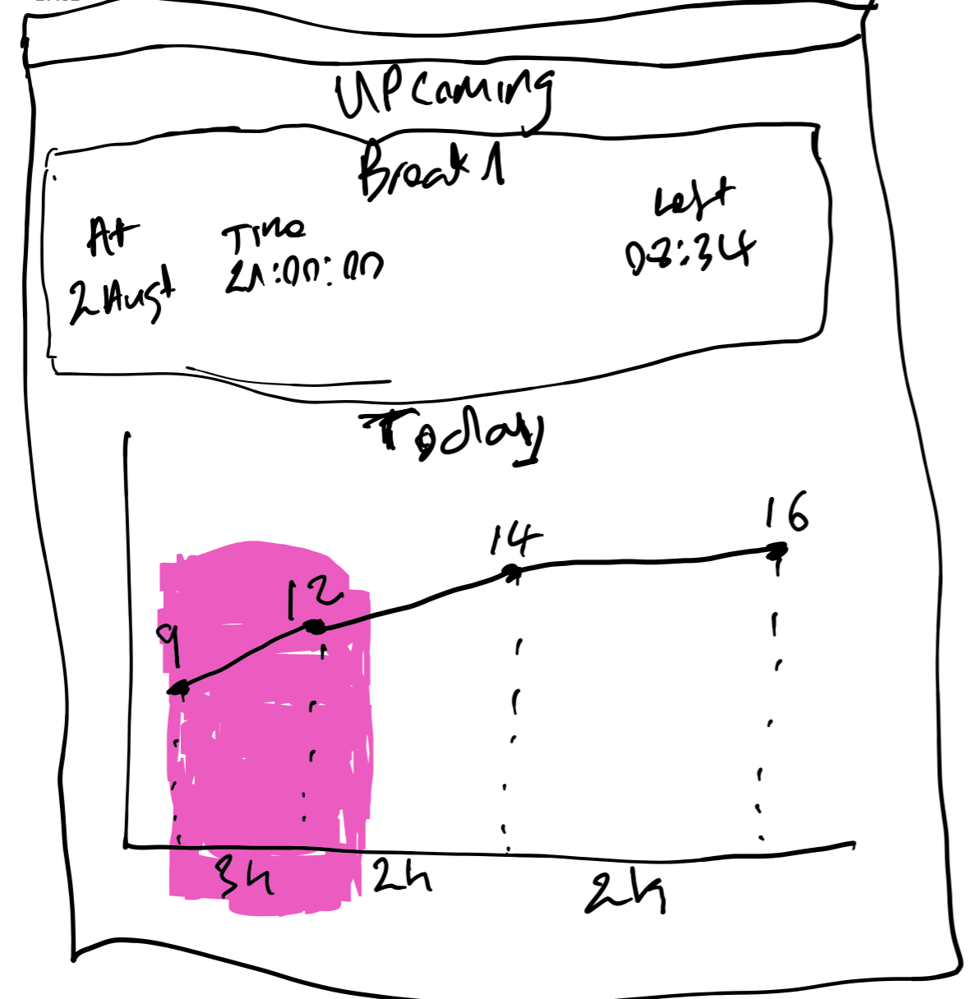
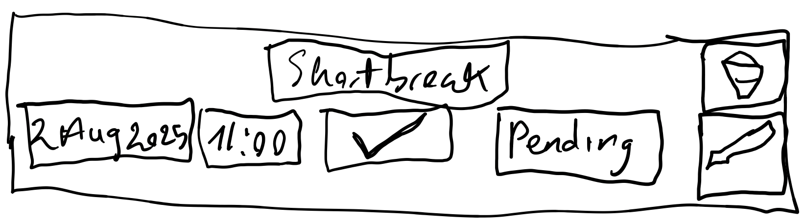
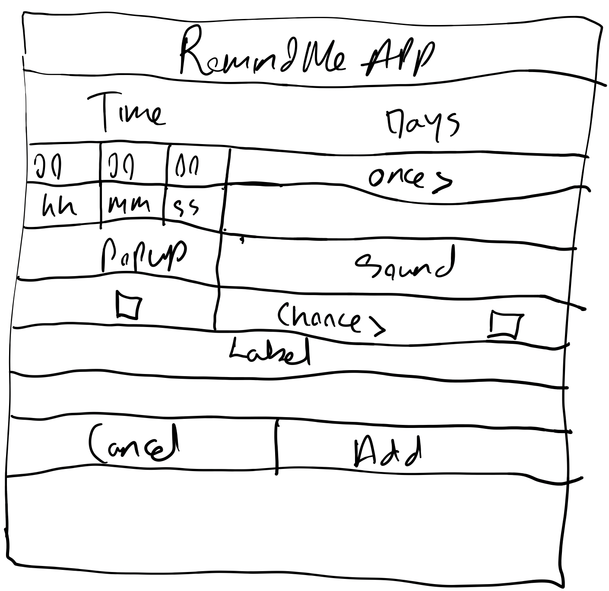
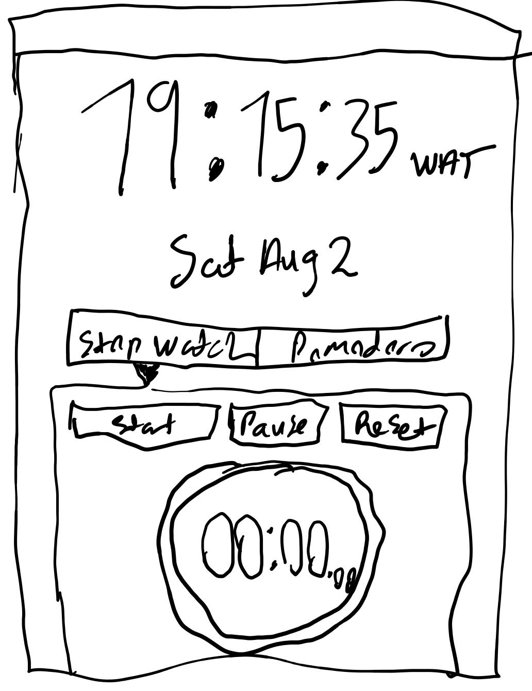
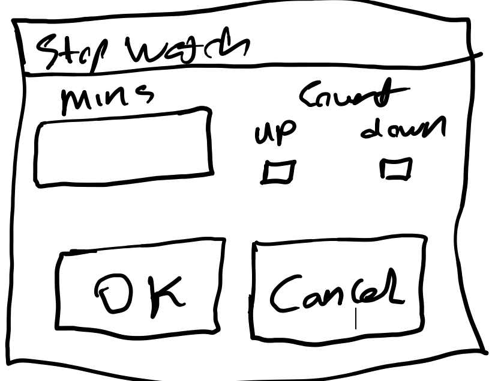

# Remind Me App

This is a refined version of the [remindme-app](https://github.com/Eyongkevin/remindme-app).

Here are some major non-functional changes from the old version
- It's more portable since it now uses sqlite3 and not postgresql
- It's more flexible as it integrates `kivyMD` and  will be tested on these systems: `windows`, `Mac`, `Linux`.
- Contains more test coverage with a CI-CD pipeline
- Deployed on `pypi`.

## Screens
Here are the screens that will be developed

- Home
- ListRemainder
    - AddReminder
- TimeTracker

## Tech Stack
After the old version, here are some important tech stacks
- Python
- Kivy
- KivyMD
- Sqlite3
- pytest
- schedule
- SQLAlchemy
- GitHub Action

## Screen Details
For version 2, screens will contain the following

### Home Screen
This will be the default page when you start the application. It will contain the following.

- The upcoming remainder event
    - label
    - time and date
    - remaining time before event that decrement in real-time
- A graphical representation of the current day's remainders that shows a line graph indicating the remainders and the time distance between them.

### ListRemainder Screen
This screen should list all remainders (sorted by day/time) that have been set in the application.

This screen should have
- Remainder items in a scroll-down list
- `Add+` button to add remainder events by calling the `AddReminder` screen
- Search bar to search remainder by label
- Filters to filter by 
    - remainder status(`Pending`, `Passed`, `All`). 
        - `All` is default
    - date and date range(selected from a Calendar). 
        - `Today's date` is default
    - active/desable state
        - `active` is default

#### Reminder Item
Each reminder item should have the following:
- label
- time
- date
- active/desable button that toggles 
- status[`pending`, `passed`]
- action buttons
    - delete
        - Will open a confirmation popup
    - edit
        - Will open the `AddReminder` screen and prefill all fields

### AddReminder Screen
It contains configuration to add/update remainder events

- Time
    - Hours, Minutes, Seconds
- Days
    - Once Popup
        - selection days
        - Repeat Button
- Alarm type
    - screen notification
    - play Sound 
        - Select sound from computer(app sound is default)
        - Sound will be path to sound from the computer.
- Label
- Buttons
    - Cancel
    - Add
- Cron job notification for a successfully added remainder. 

# TimeTracker
This screen will contain functionalities that has to do with tracking time. It will display the time, timezone and date in real-time base on the system's timezone

This screen will contain the following main tabs
- Stop watch
    - Buttons: `start`, `pause`, `reset`
        - The `start` helps us set the timer
            - Opens a popup to 
                - insert the `minutes` to time
                - `OK` and `Cancel` button
                - Option to count down or up
    - **NB**:  We **shouldn't** be able to update the time once set.
        - The `pause` will pause the timer
        - The `reset` will stop and reset the timer.
    - real-time timer 

Time Tracker

Stop Watch Popup

- Pomodoro tracker (**To be implemented Soon**)
    - Create event to be tracked. Each event will have
        - label
        - note
        - work/rest time
        - sound/popup when work/rest times are reached.
            - sound when work time starts
            - sound when rest time starts
        - is_active that indicates if the specific event is active
        - start_at: To program when it should start
        - ends_at: To program when it should stop
        - Days: Days it should run once or repeatedly
        - Repeat: If it should repeat for those days or not.
        - belong_to_reminder: If it belongs to a remainder or not. and if it does, then it will be managed by that remainder. For example, it stops when the remainder has passed.
        - alarm_delay: How many minutes to the start times
    
