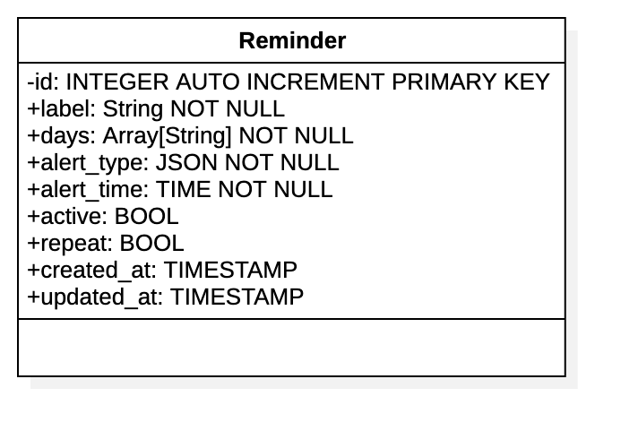
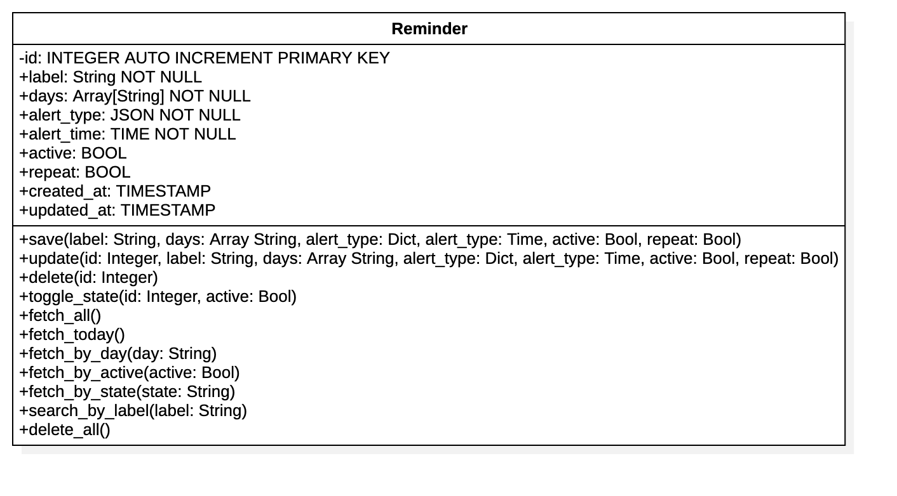

# Remind Me App 

## Database Modelling

### Phase 1
#### Mission Statement
The purpose of the Remind-Me-App database is to store task reminder information and support effective task tracking.

#### Mission Objectives
- Fetch up-coming reminder
- Fetch today's reminders
- Save reminder data
- Update reminder 
- Delete reminder
- Disable/Enable reminder
- Change reminder's state
- List reminder information sorted by time
- filter reminder information by `status`, `day` and `state`
- Search reminder by label
- delete all reminders


### Phase 2
#### Analyzing the current database
```sql
CREATE TABLE remindmeapp (
   id SERIAL PRIMARY KEY,
   label VARCHAR(100),
   alert_time TIME NOT NULL,
   days CHAR(3) ARRAY, 
   type JSONB, -- {'sound': true, 'popup': false}
   active BOOL,
   created_at TIMESTAMP DEFAULT now(),
   modified_at TIMESTAMP DEFAULT now()
);

```
- Here `type` has the data type `JSONB`. Though supported by SQLite, it doesn't have a built-in JSONB data type. So, it uses the `TEXT` data type to store JSON data, then provides functions like `json_extract()` to extract a value from JSON data using a specific path. The fact that it saves the data as a text, I don't think it provides enough constraint on the data format.
- `days` has the data type `array`, but this data type is not supported in SQLite. Like with JSON, it uses the `TEXT` data type. So here, we can serialize the array to a JSON string, then store it. And after retrieving, we deserialize the array.

### Conclusion
The database contains the only table of our app. Most of the attributes of the table will make it to the Preliminary field list. Since `type` and `days` are not provided by the user, I think using the sqlite3 way to store them as json and array is okay. For the new system, we will refine the exising table's attributes and add more attributes.

### New System

Like the old system, the new system will have only one table. 

#### Preliminary Field List
Base on the new requirement, here is the preliminary list of fields
- label
- days
- alert type
- active
- alert time
- repeat
- created at 
- updated at

#### Primary Key
I can't really establish a natural primary key from the list above. So, we will create an artificial primary key: `id`.

#### Class Diagram


#### Identify methods
Here, we will evaluate the `mission statements` in order to identify method specifications(name, parameter, return data type)
- Create database and table
- Write queries to test mission statements
- Adjust class diagram with methods

After doing the above, the updated class diagram can be seen below.
